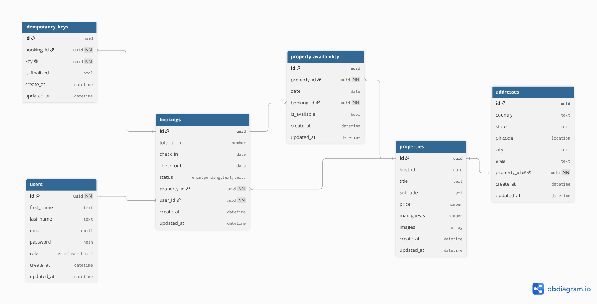
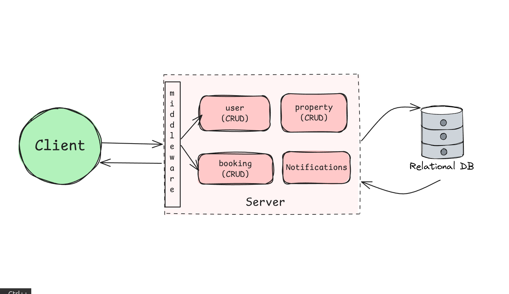
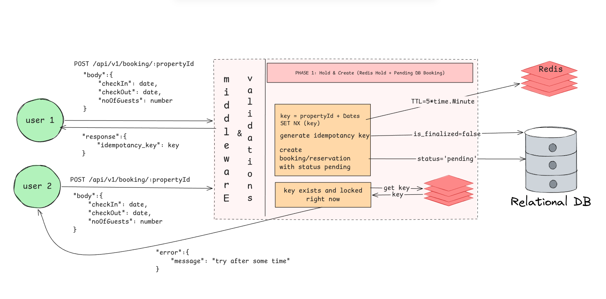
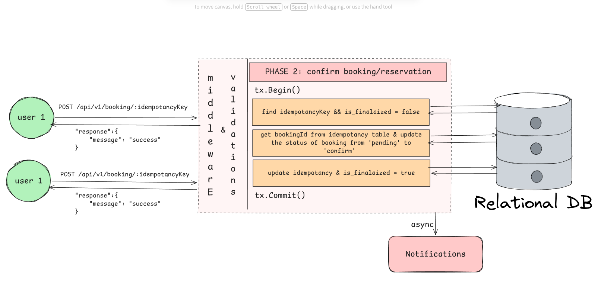
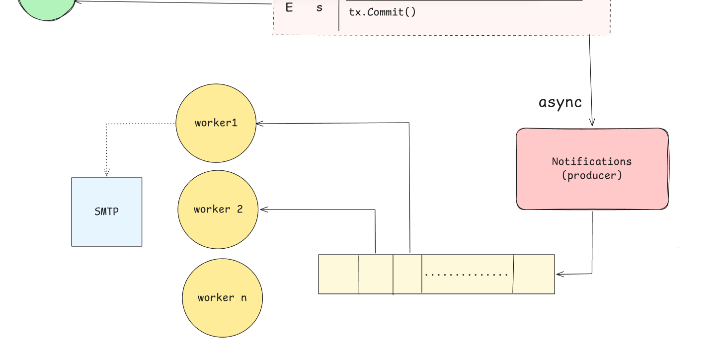

# Stayz - A booking platform inspired by Airbnb

> A high-concurrency, transaction-safe RESTful backend engine for real-time property reservations & bookings built with `GoLang`, `PostgreSQL`, and `Redis`.

## Tech Stack

* **Language:** Go (GoLang)
* **Web Framework:** Echo v4
* **Database:** PostgreSQL + Redis
* **Database Migrations:** Tern
* **Containerization:** Docker 
* **Deployment:** GCP Cloud Run (Artifacts: Docker Image + Tern Migrations)

## 📁 Directory Structure

```text
.
├── cmd/
│   └── app/                # Application entrypoint (main.go, server setup)
├── internal/               # Core business logic & private app code
│   ├── config/             # Environment variables & configuration loaders
│   ├── database/           # DB setup, pgx pool connection, redis client
│   ├── auth/               # Auth payloads, models, repository, service & handler
│   ├── booking/            # Booking payloads, models, repository, service & handler
│   ├── dir/                # Directory payloads, models, repository, service & handler
│   └── property/           # Property payloads, models, repository, service & handler
│   ├── errs/               # Custom AppError & domain sentinel errors definitions
│   ├── handler/            # Centralized HTTP handlers (calls all handler contructors)
│   ├── middleware/         # Centralized error middleware, Auth JWT, Idempotency
│   ├── repository/         # Centralized repository layer (calls all repository contructors)
│   ├── router/             
|       ├── v1/
|           ├── main.go     # API v1 router setup
|           ├── user.go     # API v1 user routes
|           ├── booking.go  # API v1 booking routes
|           ├── property.go  # API v1 property routes
|       ├── router.go       # Centralized echo router setup
│   └── service/            # Centralized service layer (calls all service contructors)
│   └── server/             # HTTP server setup, initilizes dependncies and inject & graceful shutdown
├── migrations/             # Tern database migration files (.sql scripts)
├── docker-compose.yml      # Local dev environment setup (Postgres & Redis)[TODO]
├── Go.mod
└── Go.sum
```

## Database Architecture & Schema Design

The database schema is designed in PostgreSQL with a strong focus on **ACID compliance**, **relational integrity**, and **race-condition safety** for property reservations.



---

### Key Entities & Relational Rules

* **`users`**: Central identity table holding user details.
* **`properties` & `addresses` (1:1)**: Property metadata is decoupled from physical location. `addresses` maintains a strict One-to-One relationship via `property_id UNIQUE` constraint.
* **`bookings`**: Stores reservation states, price calculations, and date windows (`check_in`, `check_out`). Has 1:M relationships with `users` and `properties`.
* **`property_availability` (Junction / Calendar Table)**: Prevents overlapping bookings. Tracks daily date-level lock states for each property. Linked to both `properties` and `bookings`.
* **`idempotency_keys`**: Stores unique idempotency payloads linked to `bookings` to prevent duplicate operations during network retries.

---

## High-Level Architecture & Core Systems

High level overview of Stayz architecture and its core services.



---
I built the Stayz Booking Engine with a **Two-Phase Reservation System** to handle property bookings safely. It combines **Redis** (for quick property holds) and **PostgreSQL** row locking (for finalizing bookings) to completely **prevent double-booking** issues under high traffic.

### Two-Phase Booking Architecture

#### Phase 1: **Hold & Create (CreateBookingService)**



- Redis Property Lock (SET NX): When a user selects dates, the system creates a temporary Redis key: hold:property:{id}:dates:{checkIn}_{checkOut}. This ensures only one user can attempt to reserve that date slot at a time.
- Smart Failure Checks: If the Redis lock is already held:
  - **Same User**: Returns "Reservation already in progress".
  - **Different User**: Returns "try again after some time".
- **Safe DB Writes** (context.WithoutCancel): I decoupled the database context from the HTTP request lifecycle. Even if the user disconnects mid-request, the pending booking row is safely created without data loss.
- **Auto Rollback on Error**: If the DB insertion fails, the system immediately deletes the Redis lock so other users do not have to wait for the TTL to expire.

#### Phase 2: **Confirm & Finalize (ConfirmBookingService)**



- **PostgreSQL Row-Level Locking**: This phase bypasses Redis. It uses `PostgreSQL SELECT ... FOR UPDATE` to lock the `idempotency_keys` row, ensuring the same payment/confirmation key cannot be processed twice concurrently.
- **Duplicate Protection**: Checks if is_finalised == true. If already finalized, it immediately **rejects duplicate confirmation** calls and returns success to the user.
- **Atomic State Updates**: Inside a single DB transaction, the booking status transitions from pending to confirmed, the property dates are blocked, and an async notification task is queued.

---

### Asynchronous Notification System (Producer / Consumer)

I implemented a decoupled background task queue using Redis and hibiken/asynq to handle post-booking notifications asynchronously without blocking the main HTTP request thread.

